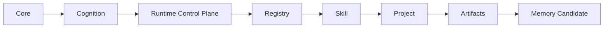
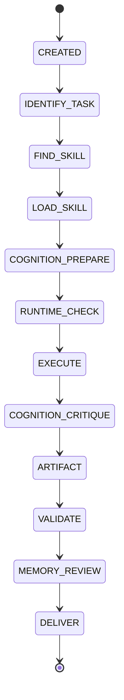

# Agent OS Architecture Evolution v0.3+

## Provenance and status

- Source: `Agent OS Architecture Evolution v0.3+.pdf`
- Source reviewed: 2026-09-04
- Repository role: normative architecture input for the v0.3+ upgrade
- Execution authority: none by itself; implementation requires an explicit user request and the repository plan/commit gates

## Role

The implementation owner acts as architecture engineer and repository maintainer for `personal-agent-os`. The objective is to evolve the repository into a governed Agent Operating System while preserving existing work and preventing capability growth from collapsing architectural boundaries.

## Before implementation

Before modifying implementation files, inspect and record:

- current branch and local HEAD;
- current GitHub `main` SHA;
- local-only commits;
- modified and untracked files;
- existing Runtime implementation;
- existing TOEFL Skill work;
- conflicts and the preservation strategy.

Destructive reconciliation is forbidden: no reset, clean, force-push, or deletion of existing artifacts.

## Required architecture decision process

Before each major architecture decision, record all three stages:

1. Expansion: compare a minimal-change option, a platform-architecture option, and a future multi-project option. Evaluate scalability, complexity, migration risk, and maintenance cost.
2. Critique: check duplication, OS/Project responsibility mixing, hidden coupling, and creation of another source of truth.
3. Decision: document the selected boundary, rationale, rejected alternatives, consequences, and future changes enabled.

## Core architecture principle

This is a one-directional ownership and execution-authority chain. A downstream layer may not redefine an upstream layer.

## Layer responsibilities

| Layer | Owns | Must not own |
| --- | --- | --- |
| Core | Global principles, execution rules, system invariants | Domain knowledge, Project decisions |
| Cognition | Expansion, critique, decision, and memory-transformation protocols; techniques such as random-seed divergence, cross-domain analogy, adversarial review, and evaluation functions | TOEFL rules, Project workflows, execution code |
| Runtime | Execution lifecycle, state transitions, trace, generic validation, artifact management | TOEFL imports, scoring rules, student diagnosis, persistent Memory promotion |
| Registry | Skill identity, version, status, manifest resolution, entrypoint discovery | Reasoning protocols, Memory, user preferences, architecture rules |
| Skill | Manifest, inputs, entrypoint, intermediate outputs, final artifacts, validators, version, domain intelligence | Core or Cognition policy, Project-wide governance |
| Project | Configuration, allowed Skills, Project policies | Skill semantics, global rules, Registry truth |
| Artifacts | Run-scoped outputs produced under contract | Persistent Memory or reusable policy |
| Memory Candidate | Evidence-linked proposal for later review | Automatic mutation of persistent Memory |

## Memory architecture

Persistent Memory is separated by owner:

- `memory/global/`: stable reusable preferences, reasoning rules, and long-term patterns;
- `memory/projects/<project-id>/`: architecture decisions, Project history, and failures;
- `memory/skills/<skill-id>/`: domain edge cases, benchmark failures, and improvements.

Runtime may create only a run-local `memory_candidate`. Promotion into persistent Memory is explicit, reviewed, and outside `AgentRuntime.run()`.

## Agent architecture

Agents are not knowledge containers. Every Agent contract requires:

- `name`;
- `objective`;
- `responsibility`;
- `inputs`;
- `outputs`;
- `constraints`;
- `evaluation_criteria`;
- an explanation of why the Agent must exist;
- an explanation of why an existing Skill cannot satisfy the need.

An Agent without an evaluation function or Skill-insufficiency rationale is invalid.

## Execution lifecycle target

Loading Cognition is not executing Cognition. Trace records must distinguish `loaded`, `executed`, `skipped`, `blocked`, and `validated`.

## Data boundary

- `projects/` contains non-sensitive configuration, allowed Skills, and Project policies.
- `runs/<project-id>/<run-id>/` contains inputs, intermediate files, artifacts, traces, and the run-local Memory Candidate.
- `memory/` contains promoted reusable knowledge separated into global, Project, and Skill scopes.
- `skills/*/output/` is never permanent run storage.

## TOEFL Skill boundary

Do not rewrite TOEFL logic. Preserve:

`input -> evidence -> assessment -> diagnosis -> learning -> artifacts -> validation`

TOEFL remains a Skill/Project. It cannot redefine Agent OS, add domain knowledge to Runtime, or change scoring semantics as part of the architecture upgrade.

## Implementation phases

1. Phase 0 - protect current state and publish repository state, conflict, and preservation reports.
2. Phase 1 - establish Memory, Runtime, Agent-role, extension, and Project-boundary governance contracts.
3. Phase 2 - establish machine-readable Registry, Skill manifest, Project, Run, Memory Candidate, and Agent-role contracts.
4. Phase 3 - upgrade Runtime to execute `Task -> Registry -> Skill entrypoint -> Runtime gates -> Artifact -> Validation`, removing arbitrary external executor dependency.
5. Phase 4 - integrate Cognition prepare, critique, and Memory review hooks without automatic persistent-Memory writes.
6. Phase 5 - verify the TOEFL Skill boundary while keeping domain logic inside the Skill and Runtime generic.

## Required output before implementation changes

The architecture gap analysis, proposed file changes, commit sequence, risk analysis, and rollback strategy must be reviewed before code changes begin.

## Success criteria

The upgrade succeeds when:

- a new Skill can be added without changing Cognition;
- a new Project can be added without polluting global rules;
- a new Agent requires an explicit contract and evaluation function;
- Runtime remains domain-neutral;
- Cognition is reusable and truthfully traced;
- Registry is machine-verifiable;
- persistent Memory cannot grow silently;
- TOEFL remains isolated as a domain capability.

Optimize for clear ownership, reversible decisions, and future extensibility.
