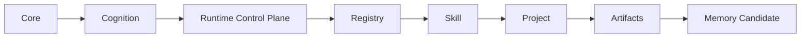

# Agent OS Architecture Boundaries v0.3+

## Purpose

Define one ownership model for Core, Cognition, Runtime, Registry, Skill, Project, Artifacts, and Memory Candidate. Detailed rules live in the canonical policy files under `docs/policies/`.

## Authority chain

`Core -> Cognition -> Runtime Control Plane -> Registry -> Skill -> Project -> Artifacts -> Memory Candidate`

The chain is the normative ownership and execution-authority flow. A downstream layer cannot redefine an upstream layer.

The chain is not a literal source-code dependency diagram. Runtime may read validated downstream Registry and Skill descriptors and dynamically invoke a declared entrypoint through generic interfaces. Runtime source must not directly import domain Skill packages, and a Project reference to an allowed Skill does not transfer Skill semantics into Project configuration.

## Layer responsibility summary

| Layer | Owns | Excludes |
| --- | --- | --- |
| Core | Global principles, execution rules, system invariants | Domain knowledge and Project decisions |
| Cognition | Expansion, critique, decision, and memory-transformation protocols | Domain rules, Project workflows, execution code |
| Runtime Control Plane | Lifecycle, states, trace, generic gates, artifact containment | Scoring, diagnosis, domain imports, persistent Memory promotion |
| Registry | Skill identity, version, status, manifest resolution, entrypoint discovery | Reasoning protocols, Memory, user preferences, architecture rules |
| Skill | Domain capability, manifest, entrypoint, inputs, outputs, validators | Core policy and Project-wide governance |
| Project | Non-sensitive configuration, allowed Skills, Project policy | Skill semantics, Registry truth, global rules |
| Artifacts | Run-scoped outputs created under contract | Persistent policy or Memory |
| Memory Candidate | Evidence-linked proposal after validation | Automatic persistent-Memory mutation |

## Cognition techniques

Cognition can use random-seed divergence, cross-domain analogy, adversarial review, and evaluation functions as reusable methods. These techniques do not grant Cognition ownership of TOEFL rules, Project decisions, or Runtime code.

## Data ownership summary

- Tracked Project configuration belongs under `projects/`.
- Run inputs, work files, artifacts, traces, and candidates belong under `runs/<project-id>/<run-id>/`.
- Promoted knowledge belongs under global, Project, or Skill Memory according to `docs/policies/MEMORY_POLICY.md`.
- Skill source directories are not permanent run storage.

## Canonical policies

- `docs/policies/RUNTIME_POLICY.md`
- `docs/policies/MEMORY_POLICY.md`
- `docs/policies/AGENT_ROLE_POLICY.md`
- `docs/policies/EXTENSION_POLICY.md`
- `docs/policies/PROJECT_BOUNDARY_POLICY.md`

## Architecture decisions

Accepted rationale and rejected alternatives are indexed in `docs/adr/README.md`. A change that contradicts an accepted ADR stops before implementation until the repository owner approves a new or superseding decision.
