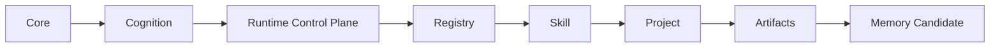

# Agent OS Architecture Boundaries v0.3+

## Purpose

Define one ownership model for Core, Cognition, Runtime, Registry, Skill, Project, Artifacts, and Memory Candidate. Detailed rules live in the canonical policy files under `docs/policies/`.

The verified v0.3+ publication state is recorded in `docs/REPOSITORY_STATE.md`. This document defines boundaries; it does not advertise unfinished extension points as available capabilities.

## Authority chain

`Core -> Cognition -> Runtime Control Plane -> Registry -> Skill -> Project -> Artifacts -> Memory Candidate`

The chain is the normative ownership and execution-authority flow. A downstream layer cannot redefine an upstream layer.

The chain is not a literal source-code dependency diagram. Runtime may read validated downstream Registry and Skill descriptors and dynamically invoke a declared entrypoint through generic interfaces. Runtime source must not directly import domain Skill packages, and a Project reference to an allowed Skill does not transfer Skill semantics into Project configuration.

Capability providers are typed infrastructure ports whose identifiers and payloads remain opaque to Runtime. Provider availability does not grant Runtime domain ownership; the canonical rules are in `docs/policies/RUNTIME_POLICY.md`.

## Layer responsibility summary

| Layer | Owns | Excludes |
| --- | --- | --- |
| Core | Global principles, execution rules, system invariants | Domain knowledge and Project decisions |
| Cognition | Expansion, critique, decision, and memory-transformation protocols | Domain rules, Project workflows, execution code |
| Runtime Control Plane | Lifecycle, states, trace, generic gates, artifact containment | Scoring, diagnosis, domain imports, persistent Memory promotion |
| Registry | Skill identity, version, status, manifest resolution, entrypoint discovery | Reasoning protocols, Memory, user preferences, architecture rules |
| Skill | Domain capability, manifest, entrypoint, inputs, outputs, validators | Core policy and Project-wide governance |
| Project | Non-sensitive configuration, allowed Skills, Project policy | Skill semantics, Registry truth, global rules |
| Artifacts | Run-scoped outputs created under contract | Persistent policy or Memory |
| Memory Candidate | Evidence-linked proposal after validation | Automatic persistent-Memory mutation |

## Cognition and Agent proof boundaries

Cognition can use random-seed divergence, cross-domain analogy, adversarial review, and evaluation functions as reusable methods. These techniques do not grant Cognition ownership of TOEFL rules, Project decisions, or Runtime code.

Protocol selection or loading is not execution proof. The trace distinguishes loaded, executed, skipped, blocked, and validated Cognition states under `core/workflow.md` and ADR-0005.

Agents are evaluated roles, not knowledge containers. Their declarations must satisfy `contracts/agent-role.schema.json`, including evaluation criteria and explanations of why an Agent is required and why a Skill is insufficient. Detailed ownership remains in `docs/policies/AGENT_ROLE_POLICY.md`.

## Data ownership summary

- Tracked Project configuration belongs under `projects/`.
- Run inputs, work files, artifacts, traces, and candidates belong under `runs/<project-id>/<run-id>/`.
- Promoted knowledge belongs under global, Project, or Skill Memory according to `docs/policies/MEMORY_POLICY.md`; Runtime can create only a run-local proposed Memory Candidate and owns no promotion path.
- Skill source directories are not permanent run storage.

## Registry status boundary

Registry is the only Skill discovery/status authority. Every `active` Skill must pass Registry/manifest validation and resolve a safe Skill-local entrypoint. A `development` Skill may have an incomplete executable contract but receives no execution authority. `toefl-writing-grader` remains `development`; its truth source is `docs/TOEFL_SKILL_ACTIVATION_CRITERIA.md`.

## Canonical policies

- `docs/policies/RUNTIME_POLICY.md`
- `docs/policies/MEMORY_POLICY.md`
- `docs/policies/AGENT_ROLE_POLICY.md`
- `docs/policies/EXTENSION_POLICY.md`
- `docs/policies/PROJECT_BOUNDARY_POLICY.md`

## Architecture decisions

Accepted rationale and rejected alternatives are indexed in `docs/adr/README.md`. A change that contradicts an accepted ADR stops before implementation until the repository owner approves a new or superseding decision.

`docs/PLAN_STATUS.md` is the authority for current versus historical plans. Historical plans remain provenance and do not override this document, canonical policies, accepted ADRs, or machine contracts.

## Automated enforcement

`tests/test_architecture_boundaries.py` audits Runtime imports, persistent-Memory write targets, tracked run/output data, active and development Skill status behavior, Agent-role rejection, and canonical authority links against the actual repository. `.github/workflows/ci.yml` installs dependencies, validates contracts, runs that audit and the full unit suite, and invokes `git diff --check`. The whitespace command checks only the diff present in the CI checkout; it does not audit historical repository whitespace.

The current Registry has no production-active Skill. `toefl-writing-grader` 2.0.0 remains `development`, and test-only active fixtures do not constitute published capabilities.
