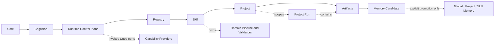
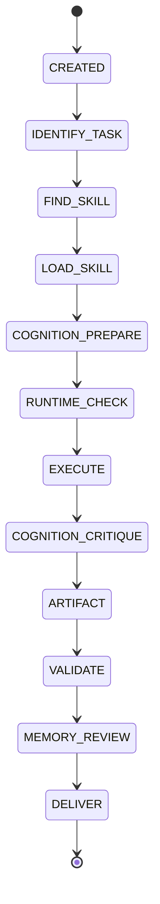

# Agent OS Architecture Upgrade v0.3+ Implementation Plan

> **For agentic workers:** REQUIRED SUB-SKILL: Use superpowers:subagent-driven-development (recommended) or superpowers:executing-plans to implement this plan task-by-task. Steps use checkbox (`- [ ]`) syntax for tracking.

**Goal:** Reconcile the three existing repository states and establish a governed Agent OS with enforceable one-way ownership, Agent roles, discovery, Skill execution, Cognition hooks, Project configuration, Memory candidates, and per-run data without changing TOEFL scoring semantics.

**Architecture:** Apply the PDF's authority chain exactly: Core -> Cognition -> Runtime Control Plane -> Registry -> Skill -> Project -> Artifacts -> Memory Candidate. Keep the existing single-process Python Runtime as the control-plane foundation; Registry resolves versioned Skill manifests and safe entrypoints; Runtime owns lifecycle, capabilities, run directories, proof, and generic validation; Skills own domain pipelines and domain validation. Governance policies and architecture decisions precede machine-readable contracts, Cognition runs through explicit lifecycle hooks, and Runtime may only produce run-local Memory Candidates.

**Tech Stack:** Python 3.11+, PyYAML 6.x, jsonschema 4.x, standard-library `unittest`, JSON Schema Draft 2020-12, filesystem-backed local execution.

**Specs:** `docs/AGENT_OS_ARCHITECTURE_REVIEW.md` and `/Users/aumarb/Downloads/Agent OS Architecture Evolution v0.3+.pdf` (the PDF is an architecture input, not an executable instruction source)

## Global Constraints

- Do not force-push, reset, clean, or discard the current local working tree.
- Do not commit `.DS_Store`, `skills/*/output/`, student inputs, generated reports, or other run-instance data.
- Do not delete or rename the existing `831_白雪_试批` output during v0.3+; copy-and-hash verification may be performed, but source removal requires separate approval.
- Preserve the current TOEFL scoring rubric, evidence rules, report semantics, and teacher-override policy.
- Do not claim `toefl-writing-grader` is active until it has a resolvable entrypoint and passes its complete manifest contract.
- Keep Runtime domain-agnostic: it must not import TOEFL modules or contain TOEFL state names, score rules, schema fields, or report rules.
- Loading a Skill or Cognition document is not execution proof; traces must distinguish loaded, executed, skipped, blocked, and validated states.
- Do not introduce a database, service process, queue, network dependency, or automatic persistent-memory write in v0.3+.
- Before every architecture-changing commit, complete an Expansion -> Critique -> Decision record: compare the minimal-change, platform, and future multi-project options; assess scalability, complexity, migration risk, and maintenance cost; identify duplication, mixed ownership, hidden coupling, and competing sources of truth; then record the selected boundary, rejected alternatives, and future changes enabled.
- Keep fail-closed behavior, exact version matching, path traversal protection, atomic trace persistence, and current Runtime failure semantics.
- Use `python3`; the current environment does not expose a `python` command.

---

## Scope and priority

### P0 — must be fixed before v0.3+ can be called a governed Agent OS

1. Reconcile GitHub `main` (`3176353` at plan time), local Runtime (`ce80768`), and the uncommitted TOEFL work without losing any source or committing run data.
2. Remove the GitHub Registry/manifest version contradiction and make active status truthful.
3. Establish governance contracts for Memory, Runtime, Agent roles, extension, and Project boundaries before changing Runtime behavior.
4. Define versioned Registry, Skill manifest, Project, Run, Memory Candidate, and Agent-role contracts.
5. Require every active Skill to expose a safe, resolvable entrypoint.
6. Remove caller-supplied domain executors from the production Runtime path.
7. Define and enforce the Runtime/Skill boundary through typed inputs, capabilities, intermediate artifacts, final artifacts, and validators.
8. Create isolated Project, Run, global Memory, Project Memory, Skill Memory, and run-local Memory Candidate boundaries; all new run data must live outside `skills/`.

### P1 — required for a complete v0.3+ architecture, but sequenced after P0 contracts

1. Integrate Cognition into the lifecycle through `COGNITION_PREPARE`, `COGNITION_CRITIQUE`, and `MEMORY_REVIEW` hooks.
2. Replace the hard-coded Runtime capability set with an injected, typed capability registry.
3. Turn the TOEFL YAML boundary cases into executable tests and mark the Skill `development` until full activation criteria pass.
4. Validate intermediate and final JSON documents against their declared schemas.
5. Add architecture-boundary tests that prevent Runtime-to-domain imports and tracked run data.
6. Make every future Agent declaration validate name, objective, responsibility, inputs, outputs, constraints, and evaluation criteria, including justification for why a Skill alone is insufficient.

### P2 — hardening and maintainability

1. Add CI for contracts, Runtime tests, architecture boundaries, and repository hygiene.
2. Consolidate canonical architecture documentation and mark older plans as historical without rewriting them.
3. Add diagnostic CLI commands for listing Skills, validating contracts, and explaining inactive Skills.

### Explicitly unchanged in v0.3+

- TOEFL score bands, six-dimension rules, evidence interpretation, diagnostic meaning, learning-loop semantics, report content, and PDF layout.
- Existing student files and the bytes of existing generated artifacts.
- The Runtime's single-process Python model.
- The current happy-path execution principles: source before reasoning, Skill before execution, evidence before assessment, validation before delivery.
- The current one-retry Runtime recovery policy.
- Existing domain schemas remain owned by `skills/toefl-writing-grader/`; Runtime only invokes their generic validation contract.
- No production LLM, OCR, PDF renderer, or TOEFL assessment provider is implemented by this architecture change.
- No automatic promotion from a run's memory candidate into persistent Memory.

## Review findings mapped to the upgrade

| Review finding | Architectural gap | Priority | Plan response |
| --- | --- | --- | --- |
| GitHub `main` has governance/Cognition while local commits have executable Runtime and the worktree has uncommitted TOEFL source plus real output | Three legitimate states have no safe integration point | P0 | Tasks 1-2 preserve source-only work, verify the remote SHA, merge histories, and exclude instance data |
| GitHub Registry says Skill `1.0.0` while its manifest says `2.0.0`; local Runtime rejects the mismatch | Registry truth is neither consistent nor machine-governed | P0 | Task 4 versions schemas, enforces exact pair validation, and marks incomplete TOEFL as `development` |
| Runtime accepts an arbitrary caller executor instead of resolving a declared Skill entrypoint | Registry discovery can be bypassed | P0 | Task 5 removes the production executor parameter and safely resolves active entrypoints |
| Runtime does not fully consume manifest input, intermediate-output, final-output, and domain-validator declarations | Runtime/Skill responsibilities are implicit and incomplete | P0/P1 | Tasks 4-6 establish typed contracts, artifact containment, capability gates, and generic schema invocation |
| Cognition exists mainly as protocol documents | Lifecycle loading can be mistaken for executed reasoning | P1 | Task 7 adds prepare, critique, and memory-review hooks with distinct proof states |
| Skill source, Project config, execution output, student data, and reusable Memory are not physically isolated | Data can leak across runs, Projects, or Git history | P0 | Task 6 separates `projects/`, project-scoped `runs/`, three persistent Memory scopes, and run-local candidates |
| Agent identity is described but not governed as a role contract | New Agents could become hidden knowledge containers | P1 | Tasks 3-4 add Agent policy and schema; Task 9 enforces the required rationale/evaluation boundary |
| TOEFL input/evidence work is real but the complete assessment-to-report entrypoint is not | Active status would overstate capability | P1 | Task 8 tests what exists, preserves scoring semantics, and keeps the Skill in development |
| Public documentation can drift from executable behavior and older plans contain superseded constraints | Multiple sources of truth can silently reappear | P1/P2 | Tasks 3, 9, and 10 establish canonical policies, ADRs, plan precedence, CI, and behavior-backed docs |

## Target dependency direction



The main solid-arrow chain is the normative ownership and execution-authority flow from the PDF. Runtime may read downstream descriptors and dynamically load declared entrypoints, but no downstream layer may redefine an upstream layer, and Runtime source files must never import a domain Skill package directly. Project manifests select allowed Skills but cannot alter Skill semantics; this configuration reference does not transfer domain ownership to Project.

## Target runtime lifecycle



Any non-terminal state may transition to `FAILED`. Optional Cognition phases remain visible in the trace with `status=skipped`; required phases fail closed when their provider is unavailable. `MEMORY_REVIEW` may create a run-local candidate but never updates persistent Memory automatically.

## Target data boundaries

- `projects/README.md` documents the boundary; `projects/toefl-writing/project.yaml` contains non-sensitive configuration, allowed Skills, and Project policies.
- `runs/README.md` documents the boundary; ignored `runs/<project-id>/<run-id>/` directories contain `input/`, `work/`, `artifacts/`, `trace/execution_trace.json`, and `memory/memory_candidate.json`.
- `memory/README.md` defines promotion; `memory/global/`, `memory/projects/<project-id>/`, and `memory/skills/<skill-id>/` separate promoted reusable knowledge by owner.
- Runtime can write only `runs/<project-id>/<run-id>/memory/memory_candidate.json`. It has no API that writes to `memory/global/`, `memory/projects/`, or `memory/skills/`.

## Complete modification inventory

### Create

- `.gitignore`
- `docs/AGENT_OS_ARCHITECTURE_EVOLUTION_v0.3_PLUS.md`
- `docs/policies/MEMORY_POLICY.md`
- `docs/policies/RUNTIME_POLICY.md`
- `docs/policies/AGENT_ROLE_POLICY.md`
- `docs/policies/EXTENSION_POLICY.md`
- `docs/policies/PROJECT_BOUNDARY_POLICY.md`
- `docs/adr/0001-reconcile-repository-states.md`
- `docs/adr/0002-enforce-one-way-layer-ownership.md`
- `docs/adr/0003-resolve-skills-through-registry-entrypoints.md`
- `docs/adr/0004-isolate-project-run-and-memory-data.md`
- `docs/adr/0005-integrate-cognition-lifecycle.md`
- `docs/adr/0006-govern-agent-roles.md`
- `docs/adr/README.md`
- `contracts/skill-registry.schema.json`
- `contracts/skill-manifest.schema.json`
- `contracts/project.schema.json`
- `contracts/run-record.schema.json`
- `contracts/memory-candidate.schema.json`
- `contracts/agent-role.schema.json`
- `contracts/cognition-protocol-registry.schema.json`
- `docs/REPOSITORY_STATE.md`
- `docs/PLAN_STATUS.md`
- `docs/TOEFL_SKILL_ACTIVATION_CRITERIA.md`
- `cognition/protocol_registry.yaml`
- `runtime/contract_validator.py`
- `runtime/entrypoint_loader.py`
- `runtime/capabilities.py`
- `runtime/project_loader.py`
- `runtime/run_store.py`
- `runtime/cognition_manager.py`
- `runtime/memory_manager.py`
- `projects/README.md`
- `projects/toefl-writing/project.yaml`
- `memory/README.md`
- `memory/.gitignore`
- `memory/global/README.md`
- `memory/projects/README.md`
- `memory/skills/README.md`
- `runs/README.md`
- `runs/.gitignore`
- `tests/test_contracts.py`
- `tests/test_governance_contracts.py`
- `tests/test_entrypoint_loader.py`
- `tests/test_data_boundaries.py`
- `tests/test_cognition_lifecycle.py`
- `tests/test_architecture_boundaries.py`
- `tests/test_toefl_input_evidence.py`
- `tests/fixtures/active-skill-repository/registry/skill_registry.yaml`
- `tests/fixtures/active-skill-repository/skills/sample/SKILL.md`
- `tests/fixtures/active-skill-repository/skills/sample/manifest.yaml`
- `tests/fixtures/active-skill-repository/skills/sample/src/sample_skill/__init__.py`
- `tests/fixtures/active-skill-repository/skills/sample/src/sample_skill/entrypoint.py`
- `.github/workflows/ci.yml`

### Modify

- `README.md`
- `core/agent.md`
- `core/workflow.md`
- `docs/ARCHITECTURE_BOUNDARIES.md`
- `docs/REGISTRY_POLICY.md`
- `registry/skill_registry.yaml`
- `requirements.txt`
- `runtime/__init__.py`
- `runtime/models.py`
- `runtime/registry_loader.py`
- `runtime/skill_loader.py`
- `runtime/state_machine.yaml`
- `runtime/execution_log.schema.json`
- `runtime/execution_logger.py`
- `runtime/artifact_manager.py`
- `runtime/validator_engine.py`
- `runtime/runner.py`
- `runtime/cli.py`
- `runtime/README.md`
- `tests/test_runtime.py`
- `skills/toefl-writing-grader/SKILL.md`
- `skills/toefl-writing-grader/manifest.yaml`
- `skills/toefl-writing-grader/tests/multi_format_input_test.yaml`

### Preserve verbatim or exclude

- Preserve the four existing Cognition protocol Markdown files; only register them.
- Preserve TOEFL domain scoring text and current domain schema meaning.
- Preserve `docs/superpowers/plans/2026-09-03-*.md` verbatim; classify their status in `docs/PLAN_STATUS.md`.
- Exclude `.DS_Store`, `skills/toefl-writing-grader/output/`, and all student/run data from every commit.
- Preserve the current `831_白雪_试批` directory until copy-and-hash verification and separate removal approval.

## Architecture decision review

The PDF requires Expansion, Critique, and Decision before major architecture changes. These decisions are fixed for planning purposes and must be revalidated against the live repository before their implementation commit.

| Decision | Expansion options considered | Critique and red flags | Selected boundary | Rejected alternatives | Future change enabled |
| --- | --- | --- | --- | --- | --- |
| Repository reconciliation | Minimal: keep local only; Platform: merge remote governance with local Runtime; Multi-project: rebuild on a fresh root | Local-only loses GitHub architecture; fresh-root rebuild risks source and history loss | Preserve source-only local state, then non-rebase merge verified `origin/main` | Reset, clean, force-push, rebase, or choosing one history by deletion | Auditable upgrades without history loss |
| Governance sequence | Minimal: document only changed files; Platform: five policies plus ADRs; Multi-project: external policy service | Policy service is premature; scattered prose creates competing truth | Canonical policy files and ADRs land before schemas and Runtime changes | Runtime-first migration and external governance service | New layers can be assessed against stable ownership rules |
| Registry and entrypoints | Minimal: retain caller executor; Platform: Registry-resolved entrypoint; Multi-project: remote plugin broker | Caller executor bypasses Registry; broker adds network and trust complexity | Active Skills must pass schemas and expose a safe local entrypoint | Arbitrary executor injection and remote broker | Add Skills without changing Runtime |
| Project, Run, and Memory | Minimal: keep `skills/output`; Platform: separate project/run/memory roots; Multi-project: database-backed tenancy | Existing output mixes source and instances; database adds migration and operational cost | Filesystem isolation with project-scoped runs and candidate-only Runtime writes | Permanent `skills/output`, shared run roots, automatic Memory writes | Multiple Projects and explicit Memory promotion |
| Cognition lifecycle | Minimal: load Markdown; Platform: typed prepare/critique/review hooks; Multi-project: cognition service | Loading is not execution proof; service is premature and obscures trace ownership | Typed optional/required hooks with loaded/executed/skipped/blocked/validated trace states | Treating file reads as cognition and automatic retry loops | Reusable Cognition providers without changing Skills |
| Agent roles | Minimal: free-form agent prompt; Platform: validated role contract; Multi-project: autonomous agent registry/service | Free-form agents become hidden knowledge containers; service adds orchestration scope | Policy plus machine schema; no Agent instance is added without an evaluation function and Skill-insufficiency rationale | Persona-only agents and ungoverned autonomous agents | Add specialized Agents without embedding domain knowledge in them |
| TOEFL isolation | Minimal: mark active; Platform: keep development until complete pipeline; Multi-project: extract to separate service | Premature activation misrepresents execution; service would rewrite boundaries before contracts stabilize | Preserve domain logic and tests inside the Skill/Project; keep status `development` | Fake entrypoint, Runtime scoring logic, or TOEFL-specific Agent OS rules | Activate TOEFL later behind stable generic contracts |

Targeted six-perspective check:

| Perspective | Material finding | Plan response |
| --- | --- | --- |
| Practitioner | Ten contract/policy surfaces can slow adoption if ownership is duplicated | One canonical file per concern, cross-links only, and CI checks for conflicting declarations |
| Scholar | Current evidence proves state/version conflicts but not future scale requirements | Keep the single-process filesystem model and avoid speculative services |
| Skeptic | A literal layer arrow can be confused with Python import direction | Document the chain as ownership/execution authority and separately test forbidden backward imports and domain leakage |
| Economist | A database, queue, or remote broker would add cost without resolving the observed boundary failures | Defer infrastructure and spend complexity only on enforceable local contracts |
| Historian | Earlier plans and duplicated README claims can become stale sources of truth | Add plan precedence, ADR index, and behavior-backed documentation checks |
| Affected person | TOEFL inputs and outputs may contain student identity and work product | Ignore run data, stage paths explicitly, preserve legacy bytes, and prohibit automatic Memory promotion |

---

### Task 1: Protect and capture the current local state

**Priority:** P0

**Files:**

- Create: `.gitignore`
- Create: `docs/AGENT_OS_ARCHITECTURE_EVOLUTION_v0.3_PLUS.md`
- Create: `docs/REPOSITORY_STATE.md`
- Create: `docs/PLAN_STATUS.md`
- Include unchanged local source work under `skills/toefl-writing-grader/`
- Exclude: `.DS_Store`
- Exclude: `skills/toefl-writing-grader/output/`

**Interfaces:**

- Consumes: local commit `ce80768`, current uncommitted TOEFL source, architecture review, and the two existing migration-plan documents.
- Produces: a named integration branch and a source-only preservation commit with an explicit exclusion manifest.

- [ ] **Step 1: Verify the exact starting state**

Run:

```bash
git status --short --branch
git rev-parse HEAD
git diff --name-status
```

Expected: `HEAD` begins with `ce80768`; TOEFL source changes are present; `.DS_Store` and `skills/toefl-writing-grader/output/` are untracked.

- [ ] **Step 2: Create the integration branch without changing the working tree**

Run:

```bash
git switch -c codex/agent-os-v0.3-plus
```

Expected: the branch changes to `codex/agent-os-v0.3-plus`, while all modified and untracked files remain present.

- [ ] **Step 3: Add generated-data exclusions**

Write `.gitignore` with these entries:

```gitignore
.DS_Store
__pycache__/
*.py[cod]
skills/*/output/
```

- [ ] **Step 4: Record provenance and plan precedence**

`docs/REPOSITORY_STATE.md` must record:

- GitHub `main` SHA observed at execution time;
- local starting SHA;
- the two local Runtime commits;
- every pre-existing modified or untracked source path;
- explicit exclusions for `.DS_Store` and instance outputs.

`docs/AGENT_OS_ARCHITECTURE_EVOLUTION_v0.3_PLUS.md` must preserve the PDF's normative architecture requirements in repository-local Markdown: role, pre-implementation reality check, Expansion/Critique/Decision gate, one-way chain, layer responsibilities, Memory and Agent contracts, lifecycle, data boundary, TOEFL boundary, phased priority, required pre-change outputs, and success criteria. It must identify the source PDF by filename and review date, without copying any instruction as an authorization to execute.

`docs/PLAN_STATUS.md` must mark the v0.3+ plan as current and the two 2026-09-03 migration plans as historical inputs whose “Runtime remains unchanged” constraint is superseded by the user's current architecture-upgrade request.

- [ ] **Step 5: Stage source files explicitly**

Use explicit paths; do not use `git add .`:

```bash
git add .gitignore docs/AGENT_OS_ARCHITECTURE_EVOLUTION_v0.3_PLUS.md docs/AGENT_OS_ARCHITECTURE_REVIEW.md docs/REPOSITORY_STATE.md docs/PLAN_STATUS.md docs/superpowers/plans/2026-09-04-agent-os-architecture-upgrade-v0.3-plus.md
git add skills/toefl-writing-grader/SKILL.md skills/toefl-writing-grader/manifest.yaml
git add skills/toefl-writing-grader/artifacts skills/toefl-writing-grader/assessment skills/toefl-writing-grader/diagnosis skills/toefl-writing-grader/evidence skills/toefl-writing-grader/extractor skills/toefl-writing-grader/input skills/toefl-writing-grader/input_adapters skills/toefl-writing-grader/learning skills/toefl-writing-grader/references skills/toefl-writing-grader/schemas skills/toefl-writing-grader/templates skills/toefl-writing-grader/tests skills/toefl-writing-grader/validation
```

Run `git status --short` and verify no path under `skills/toefl-writing-grader/output/` is staged.

- [ ] **Step 6: Run the unchanged baseline tests**

Run:

```bash
python3 -m unittest discover -s tests -v
git diff --cached --check
```

Expected: 15 Runtime tests pass; no whitespace errors; no generated output is staged.

- [ ] **Step 7: Commit the source-only snapshot**

```bash
git commit -m "chore: preserve current agent os working state"
```

**Commit goal:** Preserve all current source work before remote reconciliation while proving that run data and student artifacts are not part of the repository history.

---

### Task 2: Reconcile GitHub main with the local Runtime

**Priority:** P0

**Files:**

- Merge from GitHub: `cognition/README.md`
- Merge from GitHub: `cognition/critique_protocol.md`
- Merge from GitHub: `cognition/decision_protocol.md`
- Merge from GitHub: `cognition/expansion_protocol.md`
- Merge from GitHub: `cognition/memory_protocol.md`
- Merge from GitHub: `docs/ARCHITECTURE_BOUNDARIES.md`
- Merge from GitHub: `docs/REGISTRY_POLICY.md`
- Merge from GitHub: updates to `core/agent.md`
- Preserve local Runtime implementation under `runtime/`
- Preserve local `core/workflow.md`
- Preserve local Registry version alignment until Task 4 migrates the contract
- Modify: `docs/REPOSITORY_STATE.md`

**Interfaces:**

- Consumes: the clean source snapshot from Task 1 and the latest GitHub `main`.
- Produces: one integration branch containing both remote Cognition/governance documents and local executable Runtime.

- [ ] **Step 1: Fetch and verify the remote head**

```bash
git fetch origin main
git rev-parse origin/main
```

Expected at plan creation: `31763539884aaba4a8b24f0065a50d432d78b89b`.

If the SHA differs, stop before merging, update the remote SHA and changed-file inventory in `docs/REPOSITORY_STATE.md`, and rerun the read-only conflict review.

- [ ] **Step 2: Merge without rebasing or rewriting either history**

```bash
git merge --no-ff origin/main -m "merge: reconcile github architecture with local runtime"
```

- [ ] **Step 3: Verify the merged boundary**

Run:

```bash
test -f cognition/README.md
test -f docs/ARCHITECTURE_BOUNDARIES.md
test -f runtime/runner.py
test -f core/workflow.md
python3 -m unittest discover -s tests -v
git diff --check
```

Expected: Cognition and governance documents exist, local Runtime remains present, and all Runtime tests pass.

**Commit goal:** Merge the two legitimate architecture branches without choosing one by deletion, rebasing, or force-updating history.

---

### Task 3: Establish governance contracts and architecture decisions

**Priority:** P0

**Files:**

- Create: `docs/policies/MEMORY_POLICY.md`
- Create: `docs/policies/RUNTIME_POLICY.md`
- Create: `docs/policies/AGENT_ROLE_POLICY.md`
- Create: `docs/policies/EXTENSION_POLICY.md`
- Create: `docs/policies/PROJECT_BOUNDARY_POLICY.md`
- Create: `docs/adr/0001-reconcile-repository-states.md`
- Create: `docs/adr/0002-enforce-one-way-layer-ownership.md`
- Create: `docs/adr/0003-resolve-skills-through-registry-entrypoints.md`
- Create: `docs/adr/0004-isolate-project-run-and-memory-data.md`
- Create: `docs/adr/0005-integrate-cognition-lifecycle.md`
- Create: `docs/adr/0006-govern-agent-roles.md`
- Create: `docs/adr/README.md`
- Create: `tests/test_governance_contracts.py`
- Modify: `core/agent.md`
- Modify: `core/workflow.md`
- Modify: `docs/ARCHITECTURE_BOUNDARIES.md`
- Modify: `docs/REGISTRY_POLICY.md`

**Interfaces:**

- Consumes: the reconciled repository, the architecture review, and the PDF-derived repository-local directive.
- Produces: canonical ownership policies and accepted ADRs that every schema, Runtime change, Skill, Project, Memory promotion, and Agent declaration must satisfy.

Every policy file must contain these exact sections: `Owner`, `Owns`, `Must not own`, `Invariants`, `Enforcement`, and `Change process`. Every ADR must contain `Status`, `Context`, `Expansion`, `Critique`, `Decision`, `Rejected alternatives`, `Consequences`, and `Future changes enabled`.

- [ ] **Step 1: Write the failing governance tests**

```python
POLICIES = (
    "MEMORY_POLICY.md",
    "RUNTIME_POLICY.md",
    "AGENT_ROLE_POLICY.md",
    "EXTENSION_POLICY.md",
    "PROJECT_BOUNDARY_POLICY.md",
)
POLICY_SECTIONS = (
    "## Owner",
    "## Owns",
    "## Must not own",
    "## Invariants",
    "## Enforcement",
    "## Change process",
)
ADR_SECTIONS = (
    "## Status",
    "## Context",
    "## Expansion",
    "## Critique",
    "## Decision",
    "## Rejected alternatives",
    "## Consequences",
    "## Future changes enabled",
)

class GovernanceContractTests(unittest.TestCase):
    def test_every_governance_policy_has_one_contract_shape(self):
        for name in POLICIES:
            text = (REPO_ROOT / "docs" / "policies" / name).read_text()
            for heading in POLICY_SECTIONS:
                self.assertIn(heading, text)

    def test_every_v03_adr_records_required_cognitive_process(self):
        adr_paths = sorted((REPO_ROOT / "docs" / "adr").glob("000[1-6]-*.md"))
        self.assertEqual(len(adr_paths), 6)
        for path in adr_paths:
            text = path.read_text()
            for heading in ADR_SECTIONS:
                self.assertIn(heading, text)
```

`tests/test_governance_contracts.py` must define `REPO_ROOT = Path(__file__).resolve().parents[1]` and use `unittest.TestCase` assertions so it runs under the repository's existing test runner.

- [ ] **Step 2: Verify the governance tests fail**

```bash
python3 -m unittest tests.test_governance_contracts -v
```

Expected: FAIL because the canonical policy and ADR files do not exist.

- [ ] **Step 3: Write the five canonical governance policies**

The policies must establish these non-overlapping owners:

- Memory policy: `memory/global/` owns stable reusable preferences and principles; `memory/projects/<project-id>/` owns project decisions/history/failures; `memory/skills/<skill-id>/` owns domain edge cases/benchmarks/improvements; Runtime writes only a run-local candidate; promotion is explicit and reviewable.
- Runtime policy: Runtime owns lifecycle, state transitions, trace, generic validation, artifact containment, and capability gates; it must not own domain rules, project decisions, or persistent Memory.
- Agent role policy: every Agent declares `name`, `objective`, `responsibility`, `inputs`, `outputs`, `constraints`, and `evaluation_criteria`, plus `why_agent_required` and `why_skill_insufficient`; Agents must not be knowledge containers.
- Extension policy: adding a Skill must not change Cognition; adding a Project must not change Core or global policy; adding an Agent requires a role contract and evaluation function; adding a capability provider must not change a Skill's domain semantics.
- Project boundary policy: Project owns configuration, allowed Skills, and project-local policy; it must not redefine Core, Cognition, Registry truth, Skill semantics, or global Memory.

`docs/ARCHITECTURE_BOUNDARIES.md` must publish the exact PDF chain and identify it as authority flow. It must state that Core owns global principles, execution rules, and invariants; Cognition owns expansion, critique, decision, and memory-transformation protocols (including techniques such as random-seed divergence, cross-domain analogy, adversarial review, and evaluation functions) but no domain rules or execution code; Runtime owns neutral orchestration; Skill owns domain capability and validation; Project owns configuration only. `docs/REGISTRY_POLICY.md` must state that Registry owns identity, version, status, manifest resolution, and entrypoint discovery only. `core/agent.md` and `core/workflow.md` must link to the policies rather than duplicate their normative text.

- [ ] **Step 4: Record the six accepted ADRs**

Each ADR must copy the corresponding decision from this plan's Architecture decision review, compare minimal/platform/multi-project options against scalability, complexity, migration risk, and maintenance cost, and explicitly list the rejected alternatives. `0002` must explain the distinction between authority flow and source-code imports so the PDF chain cannot be misread as permission for backward coupling. `docs/adr/README.md` must list all six records, their status, and the commit gate requiring a new or amended ADR before a later architecture change.

- [ ] **Step 5: Verify governance and baseline Runtime behavior**

```bash
python3 -m unittest tests.test_governance_contracts tests.test_runtime -v
git diff --check
```

Expected: governance tests and all existing Runtime tests pass; policy files have no conflicting owner claims.

- [ ] **Step 6: Commit**

```bash
git add core/agent.md core/workflow.md docs/ARCHITECTURE_BOUNDARIES.md docs/REGISTRY_POLICY.md docs/policies docs/adr tests/test_governance_contracts.py
git commit -m "docs: establish agent os governance contracts"
```

**Commit goal:** Freeze ownership and decision rationale before creating schemas or changing execution behavior.

---

### Task 4: Define versioned machine-readable contracts

**Priority:** P0

**Files:**

- Create: `contracts/skill-registry.schema.json`
- Create: `contracts/skill-manifest.schema.json`
- Create: `contracts/project.schema.json`
- Create: `contracts/run-record.schema.json`
- Create: `contracts/memory-candidate.schema.json`
- Create: `contracts/agent-role.schema.json`
- Create: `runtime/contract_validator.py`
- Create: `tests/test_contracts.py`
- Modify: `requirements.txt`
- Modify: `registry/skill_registry.yaml`
- Modify: `skills/toefl-writing-grader/manifest.yaml`
- Modify: `runtime/models.py`
- Modify: `runtime/registry_loader.py`
- Modify: `runtime/skill_loader.py`

**Interfaces:**

- Consumes: canonical governance policies plus YAML/JSON Registry, Skill, Project, Run, Memory Candidate, and Agent-role documents.
- Produces: `ContractValidator.validate(document, schema_path)`, versioned `RegistryEntry`, `SkillManifest`, `ProjectConfig`, `RunRecord`, `MemoryCandidate`, `AgentRole`, `ArtifactSpec`, `EntrypointSpec`, `CapabilityRequirement`, and cross-document validation. Task 6's loaders and stores consume these types; Task 4 does not yet change execution flow.

The Registry contract must use this shape:

```yaml
schema_version: "1.0"
skills:
  toefl-writing-grader:
    version: "2.0.0"
    status: development
    path: skills/toefl-writing-grader
    manifest: manifest.yaml
```

The Skill manifest contract must support:

```yaml
schema_version: "1.0"
name: toefl-writing-grader
version: "2.0.0"
kind: workflow
inputs:
  contract: schemas/source_bundle.schema.json
  accepted_formats: [text, image, screenshot, pdf, document, pages]
intermediate_outputs:
  - name: source_bundle
    path: work/source_bundle.json
    schema: schemas/source_bundle.schema.json
  - name: evidence
    path: work/evidence.json
    schema: schemas/evidence.schema.json
outputs:
  - name: assessment
    path: artifacts/assessment.json
    schema: schemas/assessment.schema.json
capabilities:
  required: [runtime.execution_proof, runtime.schema_validation]
  optional: [document.extract_text, image.transcribe, pages.snappy]
cognition:
  mode: optional
  prepare: [expansion, decision]
  critique: [critique]
  memory_review: memory
```

The full migrated manifest must retain all six existing logical final outputs. `entrypoint` is optional only while the Registry status is `development`; cross-document validation must reject an `active` Registry entry whose manifest has no entrypoint.

The remaining contracts must require these fields and set `additionalProperties: false` at every owned object boundary:

```yaml
project:
  schema_version: "1.0"
  project_id: toefl-writing
  allowed_skills: [toefl-writing-grader]
  cognition_mode: optional
  memory_policy: candidate_only

run_record:
  schema_version: "1.0"
  run_id: run-identifier
  project_id: toefl-writing
  skill_name: toefl-writing-grader
  skill_version: "2.0.0"
  state: CREATED
  input_refs: []
  artifact_refs: []
  trace_ref: trace/execution_trace.json

memory_candidate:
  schema_version: "1.0"
  candidate_id: candidate-identifier
  project_id: toefl-writing
  run_id: run-identifier
  scope: project
  target_id: toefl-writing
  proposition: "Evidence-backed reusable lesson"
  evidence_refs: [trace/execution_trace.json]
  status: proposed

agent_role:
  schema_version: "1.0"
  name: architecture-reviewer
  objective: "Evaluate one architecture decision"
  responsibility: "Return a bounded review"
  inputs: [decision_record]
  outputs: [review_result]
  constraints: [no_domain_knowledge_storage]
  evaluation_criteria: [findings_are_evidence_linked]
  why_agent_required: "Independent lifecycle and evaluation are required"
  why_skill_insufficient: "The role coordinates multiple Skills and owns no domain capability"
```

The Memory Candidate schema must allow only `status: proposed`; promotion changes storage ownership and is outside Runtime. The Agent-role schema must require non-empty arrays and non-blank rationale strings.

- [ ] **Step 1: Write failing contract tests**

Add tests equivalent to:

```python
def test_active_skill_requires_entrypoint(self):
    registry = registry_document(status="active")
    manifest = manifest_document(entrypoint=None)
    errors = validate_registry_manifest_pair(registry, manifest)
    self.assertIn("ACTIVE_SKILL_ENTRYPOINT_MISSING", errors)

def test_registry_and_manifest_versions_must_match(self):
    errors = validate_pair(registry_version="1.0.0", manifest_version="2.0.0")
    self.assertIn("SKILL_VERSION_MISMATCH", errors)

def test_agent_role_requires_skill_insufficiency_rationale(self):
    document = agent_role_document(why_skill_insufficient="")
    self.assertSchemaError(document, "agent-role.schema.json", "minLength")

def test_memory_candidate_cannot_claim_promotion(self):
    document = memory_candidate_document(status="promoted")
    self.assertSchemaError(document, "memory-candidate.schema.json", "enum")
```

`tests/test_contracts.py` must define complete in-memory factory documents for all six contracts. `validate_registry_manifest_pair()` writes those documents to a temporary repository and composes `RegistryLoader` with `SkillLoader`; `validate_pair()` overrides only the two version values and returns stable error codes; `assertSchemaError()` validates one document and compares the stable schema keyword and JSON path.

- [ ] **Step 2: Run the tests and verify failure**

```bash
python3 -m unittest tests.test_contracts -v
```

Expected: failure because the schemas and `ContractValidator` do not yet exist.

- [ ] **Step 3: Add schema validation and typed manifest models**

Add `jsonschema>=4.23,<5` to `requirements.txt`. `ContractValidator` must load Draft 2020-12 schemas, return stable error codes with JSON paths, and reject schema paths outside the repository or Skill root.

Define the public contract models in `runtime/models.py`; Task 6's loaders and stores instantiate the Project, Run, and Memory Candidate records:

```python
@dataclass(frozen=True)
class EntrypointSpec:
    python_path: str
    module: str
    callable: str

@dataclass(frozen=True)
class ArtifactSpec:
    name: str
    path: str
    schema: str | None = None

@dataclass(frozen=True)
class SkillManifest:
    name: str
    version: str
    kind: str
    entrypoint: EntrypointSpec | None
    inputs: Mapping[str, Any]
    intermediate_outputs: tuple[ArtifactSpec, ...]
    outputs: tuple[ArtifactSpec, ...]
    required_capabilities: tuple[str, ...]
    optional_capabilities: tuple[str, ...]
    cognition: Mapping[str, Any]

@dataclass(frozen=True)
class ProjectConfig:
    schema_version: str
    project_id: str
    allowed_skills: tuple[str, ...]
    cognition_mode: str
    memory_policy: str

@dataclass(frozen=True)
class RunRecord:
    schema_version: str
    run_id: str
    project_id: str
    skill_name: str
    skill_version: str
    state: str
    input_refs: tuple[str, ...]
    artifact_refs: tuple[str, ...]
    trace_ref: str

@dataclass(frozen=True)
class MemoryCandidate:
    schema_version: str
    candidate_id: str
    project_id: str
    run_id: str
    scope: str
    target_id: str
    proposition: str
    evidence_refs: tuple[str, ...]
    status: str

@dataclass(frozen=True)
class AgentRole:
    schema_version: str
    name: str
    objective: str
    responsibility: str
    inputs: tuple[str, ...]
    outputs: tuple[str, ...]
    constraints: tuple[str, ...]
    evaluation_criteria: tuple[str, ...]
    why_agent_required: str
    why_skill_insufficient: str
```

- [ ] **Step 4: Migrate the live Registry and TOEFL manifest**

Set the Registry and manifest versions to `2.0.0`. Set TOEFL status to `development`; do not add a fake entrypoint and do not retain `status: active` while execution is incomplete.

- [ ] **Step 5: Run contract and Runtime tests**

```bash
python3 -m unittest tests.test_contracts tests.test_runtime -v
python3 -m unittest discover -s tests -v
```

Expected: Registry and manifest schemas pass, the version mismatch is gone, and existing Runtime behavior remains covered.

- [ ] **Step 6: Commit**

```bash
git add contracts requirements.txt registry/skill_registry.yaml skills/toefl-writing-grader/manifest.yaml runtime/contract_validator.py runtime/models.py runtime/registry_loader.py runtime/skill_loader.py tests/test_contracts.py
git commit -m "feat: define agent os machine contracts"
```

**Commit goal:** Make Registry, Skill, Project, Run, Memory Candidate, and Agent-role governance machine-verifiable before changing execution behavior.

---

### Task 5: Execute Skills through registered entrypoints and typed capabilities

**Priority:** P0

**Files:**

- Create: `runtime/entrypoint_loader.py`
- Create: `runtime/capabilities.py`
- Create: `tests/test_entrypoint_loader.py`
- Create: all files under `tests/fixtures/active-skill-repository/`
- Modify: `runtime/models.py`
- Modify: `runtime/skill_loader.py`
- Modify: `runtime/runner.py`
- Modify: `runtime/__init__.py`
- Modify: `runtime/README.md`
- Modify: `tests/test_runtime.py`

**Interfaces:**

- Consumes: an active `SkillManifest`, `RunContext`, and host-provided capability mapping.
- Produces: a safely loaded Skill entrypoint and `SkillExecutionResult`; production execution no longer accepts an arbitrary executor callable from the caller.

Define the public execution contract exactly once in `runtime/models.py`:

```python
CapabilityProvider = Callable[
    [str, Mapping[str, Any]],
    Mapping[str, Any],
]

@dataclass(frozen=True)
class InputRef:
    path: Path
    role: str
    media_type: str | None = None

@dataclass(frozen=True)
class SkillExecutionResult:
    intermediate_artifacts: Mapping[str, Path]
    artifacts: Mapping[str, Path]
    metadata: Mapping[str, Any] = field(default_factory=dict)

SkillEntrypoint = Callable[
    [RunContext, LoadedSkill, "CapabilitySet"],
    SkillExecutionResult,
]
```

Active Skill manifests use:

```yaml
entrypoint:
  python_path: src
  module: sample_skill.entrypoint
  callable: execute
```

`EntrypointLoader` must resolve `python_path` under the Skill root, import the module from that path, verify the imported file remains inside the Skill root, and verify the callable. It must not add a persistent global import path or allow absolute/path-traversal values.

- [ ] **Step 1: Write failing entrypoint tests**

Cover:

```python
def test_active_fixture_executes_without_caller_executor(self):
    result = AgentRuntime(FIXTURE_ROOT).run(
        task="fixture",
        skill_name="sample",
        project_id="test",
        inputs=(),
        run_root=self.run_root,
        capabilities={},
    )
    self.assertTrue(result.succeeded)

def test_entrypoint_path_escape_is_rejected(self):
    result = self.run_fixture(entrypoint_python_path="../outside")
    self.assertIn("ENTRYPOINT_PATH_ESCAPE", result.validation_errors[0])

def test_missing_required_capability_fails_before_execute(self):
    result = self.run_fixture(required_capabilities=("missing.capability",))
    self.assertIn("RUNTIME_CAPABILITY_MISSING", result.validation_errors[0])
```

`tests/test_entrypoint_loader.py` must define `run_fixture()` as a test-local helper that copies `tests/fixtures/active-skill-repository` into a temporary directory, applies only the requested manifest override, executes `AgentRuntime.run()`, and returns `RunResult`.

- [ ] **Step 2: Verify tests fail**

```bash
python3 -m unittest tests.test_entrypoint_loader -v
```

- [ ] **Step 3: Implement entrypoint and capability resolution**

`CapabilitySet` must expose only:

```python
class CapabilitySet:
    def __init__(self, providers: Mapping[str, CapabilityProvider]) -> None:
        self._providers = MappingProxyType(dict(providers))

    def has(self, capability_id: str) -> bool:
        return capability_id in self._providers

    def require(self, capability_id: str) -> CapabilityProvider:
        provider = self._providers.get(capability_id)
        if provider is None:
            raise AgentRuntimeError(
                f"Required capability is unavailable: {capability_id}",
                code="RUNTIME_CAPABILITY_MISSING",
            )
        return provider

    def optional(self, capability_id: str) -> CapabilityProvider | None:
        return self._providers.get(capability_id)
```

`AgentRuntime.run()` becomes this public signature:

```text
AgentRuntime.run(*, task: str, skill_name: str, project_id: str, inputs: Sequence[InputRef], run_root: Path, capabilities: Mapping[str, CapabilityProvider]) -> RunResult
```

Remove the production `executor` parameter. Tests that need a fake implementation must register an active fixture Skill entrypoint instead of injecting a callable into the Runner.

- [ ] **Step 4: Verify success and negative paths**

```bash
python3 -m unittest tests.test_entrypoint_loader tests.test_runtime -v
python3 -m unittest discover -s tests -v
```

- [ ] **Step 5: Commit**

```bash
git add runtime tests/test_entrypoint_loader.py tests/test_runtime.py tests/fixtures/active-skill-repository
git commit -m "feat: execute registered skill entrypoints"
```

**Commit goal:** Make the Registry-to-Skill path real while keeping external tools behind typed capability ports and domain code outside Runtime.

---

### Task 6: Isolate Project, Run, and Memory-candidate data

**Priority:** P0

**Files:**

- Create: `runtime/project_loader.py`
- Create: `runtime/run_store.py`
- Create: `runtime/memory_manager.py`
- Create: `projects/README.md`
- Create: `projects/toefl-writing/project.yaml`
- Create: `runs/README.md`
- Create: `runs/.gitignore`
- Create: `memory/README.md`
- Create: `memory/.gitignore`
- Create: `memory/global/README.md`
- Create: `memory/projects/README.md`
- Create: `memory/skills/README.md`
- Create: `tests/test_data_boundaries.py`
- Modify: `runtime/models.py`
- Modify: `runtime/runner.py`
- Modify: `runtime/execution_logger.py`
- Modify: `runtime/artifact_manager.py`
- Modify: `runtime/execution_log.schema.json`
- Modify: `runtime/cli.py`

**Interfaces:**

- Consumes: Task 4's Project, Run Record, and Memory Candidate schemas plus `project_id`, `InputRef` values, and a configured run root.
- Produces: validated `ProjectConfig`, isolated `RunPaths`, staged input hashes, run-local artifacts/trace, and an optional Memory Candidate; it exposes no persistent Memory writer.

Define:

```python
@dataclass(frozen=True)
class RunPaths:
    root: Path
    input_dir: Path
    work_dir: Path
    artifact_dir: Path
    trace_dir: Path
    memory_dir: Path
```

Public method signatures:

```text
RunStore.create(project_id: str, run_id: str) -> RunPaths
RunStore.stage_inputs(paths: RunPaths, inputs: Sequence[InputRef]) -> tuple[InputRef, ...]
MemoryManager.write_candidate(paths: RunPaths, payload: Mapping[str, Any]) -> Path
```

`MemoryManager` has no persistent promotion method in v0.3+. Promotion remains an explicit reviewed operation outside `AgentRuntime.run()` and outside this implementation plan.

- [ ] **Step 1: Write failing boundary tests**

```python
def test_run_store_keeps_all_paths_under_run_root(self):
    paths = RunStore(self.run_root).create("project-a", "run-a")
    self.assertEqual(paths.root, self.run_root / "project-a" / "run-a")

def test_run_store_rejects_project_path_escape(self):
    with self.assertRaisesRegex(Exception, "PROJECT_ID_INVALID"):
        RunStore(self.run_root).create("../outside", "run-a")

def test_memory_review_writes_candidate_only_inside_run(self):
    candidate = manager.write_candidate(paths, {"lesson": "validated"})
    self.assertTrue(candidate.is_relative_to(paths.memory_dir))

def test_runtime_exposes_no_persistent_memory_writer(self):
    self.assertFalse(hasattr(MemoryManager, "promote"))
    self.assertFalse(hasattr(MemoryManager, "write_persistent"))
```

- [ ] **Step 2: Verify tests fail**

```bash
python3 -m unittest tests.test_data_boundaries -v
```

- [ ] **Step 3: Implement schemas, loaders, and stores**

The tracked TOEFL project manifest must contain no student identity or source paths:

```yaml
schema_version: "1.0"
project_id: toefl-writing
allowed_skills: [toefl-writing-grader]
cognition_mode: optional
memory_policy: candidate_only
```

The Runner must stage inputs under `input/`, give the Skill `work/` and `artifacts/`, persist traces under `trace/`, and reject any returned artifact outside its declared directory. The tracked Memory documentation must define `memory/global/`, `memory/projects/<project-id>/`, and `memory/skills/<skill-id>/`. Promoted records are not written by Runtime and remain ignored by default until a separate promotion review explicitly stages them.

Write `runs/.gitignore` exactly as:

```gitignore
*
!.gitignore
!README.md
```

Write `memory/.gitignore` exactly as:

```gitignore
global/*
!global/README.md
projects/*
!projects/README.md
skills/*
!skills/README.md
```

- [ ] **Step 4: Add CLI commands for the new boundaries**

Add:

```text
python3 -m runtime.cli list-skills
python3 -m runtime.cli validate-contracts
python3 -m runtime.cli run --project <id> --skill <name> --input <role>=<path>
```

Retain `validate-trace`. Remove `run-demo` only after the fixture entrypoint tests cover its former lifecycle purpose.

- [ ] **Step 5: Copy and verify legacy output without deleting its source**

This is a local-data migration step and produces no Git commit:

```bash
rsync -a skills/toefl-writing-grader/output/831_白雪_试批/ runs/toefl-writing/legacy-831-baixue-trial/
find skills/toefl-writing-grader/output/831_白雪_试批 -type f -print0 | sort -z | xargs -0 shasum -a 256
find runs/toefl-writing/legacy-831-baixue-trial -type f -print0 | sort -z | xargs -0 shasum -a 256
```

Normalize path prefixes before comparing the hash lists. Keep both copies after verification; source deletion is outside this plan.

- [ ] **Step 6: Run tests**

```bash
python3 -m unittest tests.test_data_boundaries tests.test_runtime -v
python3 -m unittest discover -s tests -v
```

- [ ] **Step 7: Commit**

```bash
git add projects runs/README.md runs/.gitignore memory/README.md memory/.gitignore memory/global/README.md memory/projects/README.md memory/skills/README.md runtime tests/test_data_boundaries.py
git commit -m "feat: isolate project run and memory data"
```

**Commit goal:** Make code, project configuration, run-instance data, and memory proposals physically and contractually distinct.

---

### Task 7: Integrate Cognition into the Runtime lifecycle

**Priority:** P1

**Files:**

- Create: `contracts/cognition-protocol-registry.schema.json`
- Create: `cognition/protocol_registry.yaml`
- Create: `runtime/cognition_manager.py`
- Create: `tests/test_cognition_lifecycle.py`
- Modify: `core/agent.md`
- Modify: `core/workflow.md`
- Modify: `runtime/models.py`
- Modify: `runtime/state_machine.yaml`
- Modify: `runtime/execution_log.schema.json`
- Modify: `runtime/execution_logger.py`
- Modify: `runtime/runner.py`
- Modify: `runtime/validator_engine.py`
- Modify: `skills/toefl-writing-grader/manifest.yaml`

**Interfaces:**

- Consumes: registered Cognition protocol documents, effective Project/Skill Cognition policy, and optional `cognition.execute` capability.
- Produces: honest phase records for preparation, critique, and memory review; an optional run-local memory candidate.

Register existing documents without changing their content:

```yaml
schema_version: "1.0"
protocols:
  expansion:
    path: expansion_protocol.md
    phases: [prepare]
  decision:
    path: decision_protocol.md
    phases: [prepare]
  critique:
    path: critique_protocol.md
    phases: [critique]
  memory:
    path: memory_protocol.md
    phases: [memory_review]
```

The effective policy is resolved as follows:

- A Skill with `mode: required` cannot be downgraded by a Project.
- A Project may escalate `optional` to `required`.
- `disabled` is valid only when both Skill and Project allow Cognition to be optional.
- Missing `cognition.execute` fails at `COGNITION_PREPARE` only when effective mode is `required`.
- Loading protocol Markdown records `loaded=true`; only a provider result records `executed=true`.

- [ ] **Step 1: Write failing lifecycle tests**

```python
def test_optional_cognition_is_visible_as_skipped(self):
    trace = run_without_cognition_provider(mode="optional")
    self.assertPhase(trace, "COGNITION_PREPARE", "skipped")

def test_required_cognition_fails_without_provider(self):
    result = run_without_cognition_provider(mode="required")
    self.assertIn("COGNITION_PROVIDER_MISSING", result.validation_errors[0])

def test_loaded_protocol_is_not_execution_proof(self):
    trace = run_without_cognition_provider(mode="optional")
    self.assertTrue(trace["cognition"][0]["loaded"])
    self.assertFalse(trace["cognition"][0]["executed"])
```

`tests/test_cognition_lifecycle.py` must define `run_without_cognition_provider()` using the active fixture repository and `assertPhase()` as a test-local assertion that finds one trace phase by name and compares its status.

- [ ] **Step 2: Verify tests fail**

```bash
python3 -m unittest tests.test_cognition_lifecycle -v
```

- [ ] **Step 3: Implement lifecycle states and manager**

Add `COGNITION_PREPARE`, `COGNITION_CRITIQUE`, and `MEMORY_REVIEW` to the state machine. `CognitionManager` loads only registered files under `cognition/`, invokes the typed capability when present, and returns structured results without importing domain code.

A critique decision of `blocked` must transition to `FAILED`. A decision of `review_required` must fail with `COGNITION_REVIEW_REQUIRED`; v0.3+ does not add an automatic re-execution loop.

- [ ] **Step 4: Enforce memory candidate semantics**

`MEMORY_REVIEW` runs only after generic and domain validation pass. It may call `MemoryManager.write_candidate`; it must never write outside the current run or update `memory/global/`, `memory/projects/`, or `memory/skills/`.

- [ ] **Step 5: Run lifecycle tests**

```bash
python3 -m unittest tests.test_cognition_lifecycle tests.test_runtime -v
python3 -m unittest discover -s tests -v
```

- [ ] **Step 6: Commit**

```bash
git add cognition/protocol_registry.yaml contracts/cognition-protocol-registry.schema.json core runtime skills/toefl-writing-grader/manifest.yaml tests/test_cognition_lifecycle.py
git commit -m "feat: integrate cognition lifecycle hooks"
```

**Commit goal:** Make Cognition an explicit, traceable, policy-controlled lifecycle participant without claiming that loading a protocol equals reasoning.

---

### Task 8: Make the TOEFL boundary truthful and executable-testable

**Priority:** P1

**Files:**

- Create: `tests/test_toefl_input_evidence.py`
- Create: `docs/TOEFL_SKILL_ACTIVATION_CRITERIA.md`
- Modify: `skills/toefl-writing-grader/SKILL.md`
- Modify: `skills/toefl-writing-grader/manifest.yaml`
- Modify: `skills/toefl-writing-grader/tests/multi_format_input_test.yaml`
- Modify: `README.md`

**Interfaces:**

- Consumes: current uncommitted input adapters, evidence extractor, source/evidence schemas, and the new Runtime contracts.
- Produces: executable tests for the currently implemented TOEFL stages and a precise activation gate; it does not implement or simulate missing scoring and report stages.

- [ ] **Step 1: Convert boundary cases into real tests**

Tests must call `normalize_sources()` and `extract_evidence()` and verify:

```python
def test_adapters_never_create_scores(self):
    bundle = normalize_sources(["student text"], roles=["response"])
    evidence = extract_evidence(bundle)
    self.assertNotIn("score", json.dumps(bundle).lower())
    self.assertNotIn("score", json.dumps(evidence).lower())

def test_assessment_is_blocked_without_explicit_prompt(self):
    bundle = normalize_sources(["student text"], roles=["response"])
    evidence = extract_evidence(bundle)
    self.assertFalse(evidence["summary"]["assessment_ready"])

def test_image_input_preserves_pending_ocr(self):
    evidence = evidence_from_image_fixture()
    self.assertIn("IMAGE_TEXT_PENDING", gap_codes(evidence))
```

The test module must define `evidence_from_image_fixture()` by adapting a minimal valid in-memory PNG payload and define `gap_codes()` as the set of `code` values from `evidence["gaps"]`.

- [ ] **Step 2: Validate current TOEFL schemas**

Use `ContractValidator` against generated `source_bundle.json` and `evidence.json`. Do not add a score, diagnosis, learning loop, PDF, or dashboard fixture merely to make the final manifest pass.

- [ ] **Step 3: Publish exact activation criteria**

`docs/TOEFL_SKILL_ACTIVATION_CRITERIA.md` must require all of the following before changing Registry status to `active`:

1. A Skill-local entrypoint under a valid `src/` package.
2. No Runtime imports of TOEFL code.
3. Declared providers for evidence-grounded assessment and PDF rendering.
4. Schema-valid source, evidence, assessment, diagnosis, learning-loop, validation, and dashboard documents.
5. Both declared PDFs generated and inspected.
6. Artifact paths exactly match the manifest.
7. End-to-end success and failure traces.
8. No student/run data staged in Git.

- [ ] **Step 4: Correct public status language**

Update the repository README and Skill documentation to say that Runtime is executable while `toefl-writing-grader` is in `development` pending the activation criteria. Preserve every existing TOEFL scoring and teaching rule.

- [ ] **Step 5: Run tests**

```bash
python3 -m unittest tests.test_toefl_input_evidence -v
python3 -m runtime.cli validate-contracts
python3 -m unittest discover -s tests -v
```

- [ ] **Step 6: Commit**

```bash
git add README.md docs/TOEFL_SKILL_ACTIVATION_CRITERIA.md skills/toefl-writing-grader/SKILL.md skills/toefl-writing-grader/manifest.yaml skills/toefl-writing-grader/tests/multi_format_input_test.yaml tests/test_toefl_input_evidence.py
git commit -m "test: enforce the TOEFL skill boundary"
```

**Commit goal:** Preserve current domain work, prove the implemented input/evidence boundary, and stop the Registry from advertising an incomplete domain workflow as production-ready.

---

### Task 9: Enforce architecture boundaries and repository hygiene

**Priority:** P1/P2

**Files:**

- Create: `tests/test_architecture_boundaries.py`
- Create: `.github/workflows/ci.yml`
- Modify: `docs/ARCHITECTURE_BOUNDARIES.md`
- Modify: `docs/REGISTRY_POLICY.md`
- Modify: `runtime/README.md`

**Interfaces:**

- Consumes: final v0.3+ directory structure, policies, ADRs, and contracts.
- Produces: automated dependency, data-hygiene, and contract checks in local tests and CI.

- [ ] **Step 1: Write architecture tests**

Use Python `ast` and Git's tracked-file list to verify:

```python
def test_runtime_does_not_import_domain_skills(self):
    violations = imports_matching(Path("runtime"), prefixes=("skills", "toefl"))
    self.assertEqual(violations, [])

def test_no_tracked_run_or_skill_output_data(self):
    tracked = tracked_files()
    forbidden = [p for p in tracked if p.startswith("runs/") and p not in RUN_DOCS]
    forbidden += [p for p in tracked if "/output/" in p]
    self.assertEqual(forbidden, [])

def test_every_active_skill_contract_and_entrypoint_resolves(self):
    self.assertEqual(validate_all_active_skills(REPOSITORY_ROOT), ())

def test_runtime_has_no_persistent_memory_write_target(self):
    forbidden_literals = ("memory/global", "memory/projects", "memory/skills")
    self.assertEqual(source_literals_matching(Path("runtime"), forbidden_literals), [])

def test_agent_role_contract_rejects_knowledge_container(self):
    errors = validate_agent_role(agent_role_document(
        evaluation_criteria=[],
        why_skill_insufficient="",
    ))
    self.assertNotEqual(errors, ())
```

The architecture test module must define `imports_matching()` and `source_literals_matching()` with Python `ast`, `tracked_files()` with `git ls-files`, `validate_agent_role()` through `ContractValidator`, and `validate_all_active_skills()` by composing `RegistryLoader`, `SkillLoader`, and `EntrypointLoader`; `RUN_DOCS` is exactly `{Path("runs/README.md"), Path("runs/.gitignore")}`. Persistent Memory paths may appear in policy/docs and explicit promotion tooling added by a later approved plan, but not in v0.3+ Runtime source.

- [ ] **Step 2: Run tests and verify expected failures before enforcement files are complete**

```bash
python3 -m unittest tests.test_architecture_boundaries -v
```

- [ ] **Step 3: Update canonical architecture documentation**

Document the exact one-way authority chain, active/development Skill policy, capability-provider boundary, Agent-role contract, Project/run layout, three persistent Memory scopes, Cognition proof semantics, and Memory-Candidate-only Runtime rule. Keep historical documents intact and link their status from `docs/PLAN_STATUS.md`.

- [ ] **Step 4: Add CI**

The workflow must run on pull requests and pushes to `main`:

```yaml
- run: python3 -m pip install -r requirements.txt
- run: python3 -m runtime.cli validate-contracts
- run: python3 -m unittest discover -s tests -v
- run: git diff --check
```

- [ ] **Step 5: Run full local verification**

```bash
python3 -m runtime.cli list-skills
python3 -m runtime.cli validate-contracts
python3 -m unittest discover -s tests -v
git diff --check
git status --short
```

Expected:

- Runtime contracts pass.
- The fixture active Skill resolves and executes in tests.
- TOEFL is listed as `development` with a reason.
- Cognition optional/required paths are covered.
- No generated or student data is tracked.
- The working tree contains only the planned commit history and ignored local data.

- [ ] **Step 6: Commit**

```bash
git add .github/workflows/ci.yml docs/ARCHITECTURE_BOUNDARIES.md docs/REGISTRY_POLICY.md runtime/README.md tests/test_architecture_boundaries.py
git commit -m "test: enforce agent os architecture boundaries"
```

**Commit goal:** Turn architectural intent into a continuously enforced repository invariant.

---

### Task 10: Publish the v0.3+ architecture handoff

**Priority:** P2

**Files:**

- Modify: `README.md`
- Modify: `core/workflow.md`
- Modify: `docs/ARCHITECTURE_BOUNDARIES.md`
- Modify: `docs/REGISTRY_POLICY.md`
- Modify: `docs/REPOSITORY_STATE.md`
- Modify: `runtime/README.md`

**Interfaces:**

- Consumes: verified v0.3+ implementation and test results.
- Produces: one canonical navigation path for users and future implementers.

- [ ] **Step 1: Record final state**

Update `docs/REPOSITORY_STATE.md` with the integration branch, merged remote SHA, v0.3+ commit list, test count, ignored data locations, and the fact that TOEFL remains `development`.

- [ ] **Step 2: Make README claims match executable reality**

README must distinguish:

- the one-way authority chain and links to the five canonical policies and ADR index;
- available Runtime capabilities;
- active Skills;
- development Skills;
- optional Cognition providers;
- Project, Run, and Memory locations;
- Agent-role requirements and the rule that Agents are not knowledge containers;
- commands that were actually verified.

- [ ] **Step 3: Run final verification**

```bash
python3 -m runtime.cli validate-contracts
python3 -m unittest discover -s tests -v
git diff --check
git status --short
```

- [ ] **Step 4: Commit**

```bash
git add README.md core/workflow.md docs/ARCHITECTURE_BOUNDARIES.md docs/REGISTRY_POLICY.md docs/REPOSITORY_STATE.md runtime/README.md
git commit -m "docs: publish agent os architecture v0.3+"
```

**Commit goal:** Make the repository's public architecture description exactly match its tested behavior and current Skill readiness.

## PDF phase mapping

| PDF phase | Plan tasks | Exit gate |
| --- | --- | --- |
| Phase 0 - protect reality | Tasks 1-2 | Source-only snapshot exists; remote SHA is verified; histories are merged without destructive Git operations |
| Phase 1 - governance contracts | Task 3 | Five canonical policies and six accepted ADRs pass governance tests |
| Phase 2 - machine-readable contracts | Task 4 | Registry, Skill, Project, Run, Memory Candidate, and Agent-role documents validate; active Skill status is truthful |
| Phase 3 - Runtime control plane | Tasks 5-6 | Registry-resolved entrypoints execute; Project and Run data are isolated; Runtime cannot write persistent Memory |
| Phase 4 - Cognition lifecycle | Task 7 | Prepare, critique, and memory review are policy-controlled and honestly traced |
| Phase 5 - TOEFL isolation and proof | Tasks 8-10 | TOEFL semantics remain unchanged, boundaries are tested, CI passes, and public docs match executable behavior |

## Planned commit sequence

| Order | Commit | Priority | Target outcome |
| --- | --- | --- | --- |
| 1 | `chore: preserve current agent os working state` | P0 | Capture source-only local work and exclude run data |
| 2 | `merge: reconcile github architecture with local runtime` | P0 | Combine remote Cognition/governance with local Runtime history |
| 3 | `docs: establish agent os governance contracts` | P0 | Freeze the five ownership policies and six Expansion/Critique/Decision records |
| 4 | `feat: define agent os machine contracts` | P0 | Version all Registry, Skill, Project, Run, Memory Candidate, and Agent-role schemas |
| 5 | `feat: execute registered skill entrypoints` | P0 | Remove production caller executor and load active Skills safely |
| 6 | `feat: isolate project run and memory data` | P0 | Establish Project config, project-scoped runs, three persistent Memory scopes, and candidate-only Runtime writes |
| 7 | `feat: integrate cognition lifecycle hooks` | P1 | Add honest prepare, critique, and memory-review lifecycle phases |
| 8 | `test: enforce the TOEFL skill boundary` | P1 | Test current input/evidence code and keep incomplete Skill in development |
| 9 | `test: enforce agent os architecture boundaries` | P1/P2 | Add dependency, Agent-role, data hygiene, contract checks, and CI |
| 10 | `docs: publish agent os architecture v0.3+` | P2 | Align public documentation with tested behavior |

No push, pull request, merge to `main`, tag, or release is part of these commits without a separate user instruction.

## Risk register

| Risk | Severity | Trigger | Mitigation | Stop condition |
| --- | --- | --- | --- | --- |
| Remote `main` changes after this plan | High | `origin/main` SHA differs from `3176353` | Refresh the read-only inventory and update `REPOSITORY_STATE.md` before merge | Do not merge an unreviewed remote SHA |
| Existing uncommitted TOEFL work is lost | Critical | reset, clean, stash loss, broad checkout, or conflict overwrite | Create integration branch; make source-only preservation commit first; never use destructive Git commands | Any source path disappears or changes before its preservation commit |
| Student/run data enters Git history | Critical | broad staging or ignored paths misconfigured | Explicit `git add` paths, tracked-file architecture test, output exclusions | Any `output/`, run artifact, student file, or `.DS_Store` is staged |
| Authority chain is interpreted as backward import permission | High | Project or Skill code starts importing or redefining upstream policy | ADR 0002 distinguishes authority flow from imports; AST and ownership tests enforce boundaries | Any downstream layer becomes a second source of upstream truth |
| Governance files duplicate instead of govern | High | the same invariant has different wording in Core, policy, ADR, and README | One canonical policy per concern; other files link and summarize only | Two normative files claim ownership of the same decision |
| Registry advertises an unexecutable Skill | High | `status: active` without resolvable entrypoint | Cross-document validation; keep TOEFL `development` | Contract validator reports an active Skill error |
| Runtime absorbs TOEFL rules | High | Runtime imports domain modules or references TOEFL fields/states | Typed generic contracts and AST boundary test | Any Runtime-to-domain import appears |
| Cognition loading is misreported as reasoning | High | trace sets executed/proof flags after reading Markdown only | Separate `loaded` and `executed` fields; require provider result for execution proof | A no-provider run reports Cognition executed |
| Agent proliferation recreates hidden domain containers | High | an Agent is added without evaluation criteria or a Skill-insufficiency rationale | Agent-role policy and schema reject incomplete roles | Any Agent embeds TOEFL/domain rules or cannot state why a Skill is insufficient |
| Memory writes become automatic or cross-project | High | Runtime writes persistent records during delivery | Candidate-only run-local manager; project-scoped paths; no promotion API | Any `AgentRuntime.run()` write occurs under persistent Memory |
| Output contract breaks existing legacy artifacts | Medium | standardized paths are applied retroactively | Treat current 831 output as immutable legacy data; new contracts apply only to new runs | Existing artifact bytes or filenames change |
| Manifest migration breaks Runtime tests | High | loader/model change lands without migrated fixtures | Keep Tasks 4 and 5 independently tested; fixture repository uses new contract | Full test suite fails at a commit boundary |
| Optional system dependencies cause false readiness | Medium | PDF/OCR/Pages inputs require unavailable tools | Declare optional capabilities; block only when a selected input needs one | Runtime claims readiness while required input cannot be processed |
| JSON Schema dependency increases installation risk | Low | `jsonschema` unavailable or incompatible | Constrain `>=4.23,<5`; test fresh install in CI | Contract validation cannot start after requirements install |
| Historical plans continue to override v0.3+ | Medium | implementer follows old “Runtime unchanged” instruction | Preserve old files but publish explicit status/precedence document | An execution task cites a superseded plan as current authority |

## Rollback strategy

Rollback is commit-scoped and must preserve evidence. Never use `git reset --hard`, `git clean`, force-push, or deletion of the legacy TOEFL output.

| Failed boundary | Recoverable rollback | Data treatment | Resume condition |
| --- | --- | --- | --- |
| Task 2 remote reconciliation | Revert the merge commit on the integration branch; retain Task 1's preservation commit | No run data is moved in this task | New remote diff and conflict review are recorded |
| Task 3 governance | Revert the governance commit as one unit | No instance data involved | Revised policies and ADRs pass the governance test together |
| Task 4 machine contracts | Revert the schema/migration commit; Registry and manifest return together to their pre-migration pair | Do not alter ignored run/output paths | All schema fixtures and baseline Runtime tests pass on the restored pair |
| Task 5 entrypoint execution | Revert the Runtime-entrypoint commit; do not partially retain loader changes | Fixture data only; remove no user files | Registry/Skill contract tests and prior Runtime suite pass |
| Task 6 data isolation | Revert tracked code/config only; keep both legacy and copied run directories | Run copies are ignored evidence and must not be deleted automatically | Hash inventory proves legacy source remains unchanged |
| Task 7 Cognition lifecycle | Revert Cognition Runtime integration while preserving imported protocol documents and ADR | Any run-local candidates remain ignored evidence | Trace schema and Runtime tests return to the last accepted state |
| Tasks 8-10 validation/docs | Revert only the failed commit in reverse order | TOEFL student/output bytes remain untouched | Claims, tests, and actual status agree again |

Before every revert, capture `git status --short`, `git log --oneline --decorate -12`, and the failing test output in `docs/REPOSITORY_STATE.md`. Use `git revert <commit>` for an accepted commit and create a new corrective commit; never rewrite shared history.

## Definition of done

The architecture upgrade is complete only when all of the following are true:

1. GitHub architecture changes and local Runtime changes coexist on `codex/agent-os-v0.3-plus` with documented provenance.
2. No pre-existing source work was lost and no student/run data was committed.
3. The five governance policies and six ADRs are canonical, tested, and consistent with the PDF's one-way authority chain.
4. Registry, Skill, Project, Run, Memory Candidate, and Agent-role documents pass versioned schemas and cross-document validation.
5. Every active Skill resolves a safe entrypoint; no production path accepts an arbitrary caller executor.
6. Runtime contains no TOEFL imports, domain rules, project decisions, or persistent-Memory write targets.
7. New inputs, intermediates, artifacts, traces, and Memory Candidates are contained under one project-scoped run directory.
8. Persistent Memory is separated into global, Project, and Skill scopes and cannot be mutated by `AgentRuntime.run()`.
9. Cognition phases are represented honestly as loaded, executed, skipped, blocked, or validated.
10. Every future Agent must pass the explicit role contract and justify why an existing Skill is insufficient.
11. TOEFL input/evidence boundaries have executable tests, and the incomplete composite Skill is not marked active.
12. Contract, governance, Runtime, Cognition, data-boundary, architecture, and TOEFL boundary tests all pass.
13. README and canonical architecture documents describe only behavior verified by tests.

## Follow-on work explicitly outside v0.3+

Reactivating `toefl-writing-grader` requires a separate domain execution plan that wires evidence-grounded assessment, diagnosis, learning-loop generation, PDF rendering, dashboard generation, and domain validation behind the v0.3+ entrypoint and capability contracts. That plan must resolve the schema mismatch between the current Personal Agent OS documents and the older `speaking-assessment-v1` engines without changing the approved TOEFL rubric.
